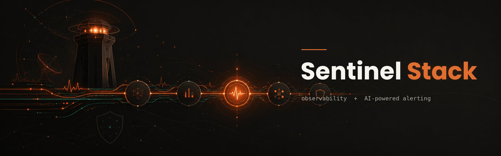

<div align="center">



# 🛰️ Sentinel Stack

**A drop-in, production-grade alerting pipeline for any service — with AI-powered triage.**

Prometheus watches your metrics. Alertmanager routes them. A tiny relay uses an LLM to triage severity, write a human summary, and optionally open a GitHub issue — then posts to chat. On-call escalation included.

[](LICENSE)
[](https://prometheus.io)
[](docker-compose.yml)
[](https://github.com/prometheus-community/yet-another-cloudwatch-exporter)
[](CONTRIBUTING.md)

</div>

---

## Why this exists

Most teams discover an outage when a customer complains. Sentinel Stack is a **complete, copy-pasteable alerting pipeline** that tells you first — and tells you *intelligently*.

It bundles the boring-but-hard parts you'd otherwise wire up yourself:

- 📊 **Application metrics** scraped straight from your app (Prometheus format).
- ☁️ **AWS metrics** (SQS, EC2, RDS, ALB, Lambda…) via a single CloudWatch exporter — no app changes.
- 🧠 **AI triage**: an LLM reads each alert, rates severity, writes a plain-language summary with fix suggestions, and decides whether to open a GitHub issue.
- 💬 **Chat notifications** with graceful degradation (alerts still arrive if the AI is down).
- 📟 **On-call escalation** for the alerts that actually need a human at 3 a.m.

Everything is driven by config files and a ~120-line relay. No vendor lock-in. Runs anywhere Docker runs.

## Architecture

```
   ┌─────────────┐         ┌────────────┐        ┌───────────────┐
   │ Your app    │──────►  │            │        │               │
   │ /metrics    │         │ Prometheus │──────► │ Alertmanager  │
   ├─────────────┤──────►  │ (scrape +  │        │ (group +      │
   │ YACE        │         │  evaluate) │        │  route)       │
   │ (CloudWatch)│         └────────────┘        └───────┬───────┘
   └─────────────┘                                       │
                                       ┌─────────────────┴───────────────┐
                                       ▼                                 ▼
                              ┌──────────────────┐               ┌──────────────┐
                              │ relay            │               │ on-call      │
                              │ AI triage        │──► Chat       │ (PagerDuty / │
                              │ + GitHub issue   │               │  iLert / …)  │
                              └──────────────────┘               └──────────────┘
```

Two metric sources feed one brain (Prometheus). One router (Alertmanager) decides where each alert goes. Warnings go to chat; criticals also page on-call.

## Quick start

```bash
git clone https://github.com/YOUR_USERNAME/sentinel-stack.git
cd sentinel-stack
cp .env.example .env          # fill in your webhooks / tokens
docker compose up -d
```

Then point Prometheus at your app by editing `config/prometheus.yml`, and you're alerting. Full walkthrough in **[docs/INSTALL.md](docs/INSTALL.md)**.

> **Want AWS metrics too?** Attach the IAM policy in [`docs/iam-policy.json`](docs/iam-policy.json) to your instance role and edit `config/yace-config.yml`. SQS works out of the box; EC2/RDS/etc. are one config block away.

## What's in the box

| Path | What it is |
|------|------------|
| `docker-compose.yml` | The whole stack: Prometheus, Alertmanager, YACE, relay. |
| `config/prometheus.yml` | Scrape targets + which alert rules to load. |
| `config/alerts.d/` | Alert rules, split by domain (app, aws-sqs, infra…). |
| `config/alertmanager.yml` | Grouping + severity-based routing. |
| `config/yace-config.yml` | Which CloudWatch metrics to pull. |
| `relay/` | The AI-triage notifier (Node.js). |
| `docs/` | Concept guide, technical reference, install manual, customization. |
| `examples/` | Ready-to-copy snippets (EC2 job, severity routing, more). |

## Documentation

| Doc | For whom |
|-----|----------|
| [**Overview**](docs/01-overview.md) | Anyone — what it is and why, in plain language. |
| [**Technical Reference**](docs/02-reference.md) | Engineers maintaining or extending it. |
| [**Install Manual**](docs/INSTALL.md) | Setting it up from scratch, with troubleshooting. |
| [**Customization**](docs/04-customization.md) | Adapting it to your own service. |
| [**The story**](docs/ARTICLE.md) | A blog-style write-up of how and why this was built. |

## Highlights worth stealing

- **The FIFO "golden signal".** For FIFO queues, age-of-oldest-message beats backlog size — a single stuck message blocks the whole group. Sentinel ships a dedicated head-of-line-blocking alert. ([why](docs/02-reference.md#6-the-golden-signal-for-fifo-queues))
- **AI triage that fails open.** If the LLM call errors, the alert is *still* delivered — the AI only enriches, never gates. ([how](docs/02-reference.md#the-relay))
- **One exporter, all of AWS.** YACE is generic: add a config block to monitor a new AWS service, no new IAM. ([how](docs/04-customization.md))
- **A battle-tested troubleshooting guide.** Docker bind-mount inode traps, cross-network DNS, `--force-recreate` gotchas — the stuff you only learn by suffering. ([read it first](docs/INSTALL.md#troubleshooting))

## Security

Never commit secrets. All credentials load from environment variables — see [`.env.example`](.env.example). If a key ever lands in git history, **rotate it immediately** (providers auto-revoke leaked keys). Details in [SECURITY.md](SECURITY.md).

## Contributing

PRs welcome — new exporters, alert rule packs, chat integrations, translations. See [CONTRIBUTING.md](CONTRIBUTING.md).

## License

[MIT](LICENSE) © contributors. Use it, fork it, ship it.

---

<div align="center">
<sub>If this saved you a weekend of YAML and Docker networking, consider leaving a ⭐.</sub>
</div>
